# Lab 5
### Cho csdl như hình. Hãy tạo một ứng dụng web sử dụng spring boot rồi thực hiện các công việc sau
1. Tạo các enities sao cho khi thực thi sẽ tạo ra các bảng như hình
2. Viết các repositories interface
3. Viết các lớp services
4. Tạo các trang web cho phép công ty đăng tin tuyển người với các skill mong muốn
5. Các ứng viên khi log vào sẽ được gợi ý các công việc có skill phù hợp với mình
6. Giúp các công ty tìm các ứng viên có skill phù hợp rồi gửi mail mời.
7. Đề xuất một số skill mà ứng viên chưa có để học.
8. Và các yêu cầu khác

Đã thực hiện yêu cầu 
1. Viết các entities bằng hibernate được lưu trong modals
2. Viết các repositories interface và services để tạo ra 1000 dữ liệu address và Candidates ngẫu nhiên
3. Hiển thị được dữ liệu của Candidates lên http://localhost:8080/candidates/list và Candidate-Paging chứa list Candidates trên http://localhost:8080/candidates/candidate
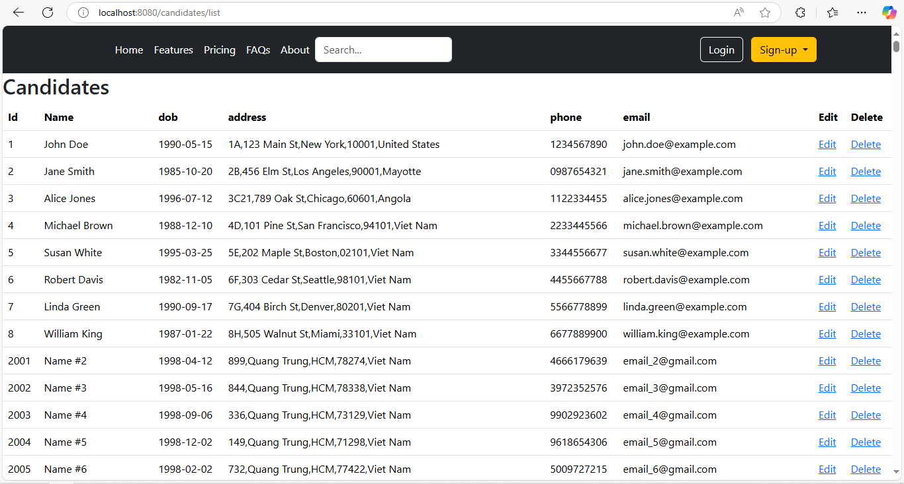
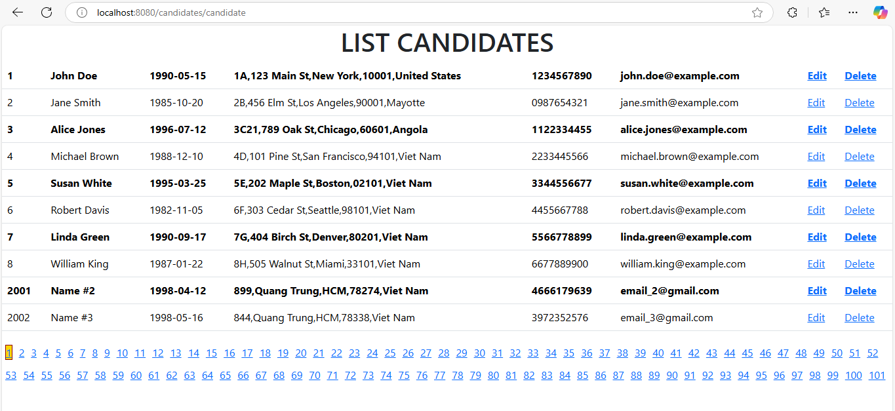
4. Trên trang chủ (http://localhost:8080) Có thể tạo mới candidate và company bấm vào sigup sẽ hiển thị 2 list addCandidate và addCompany
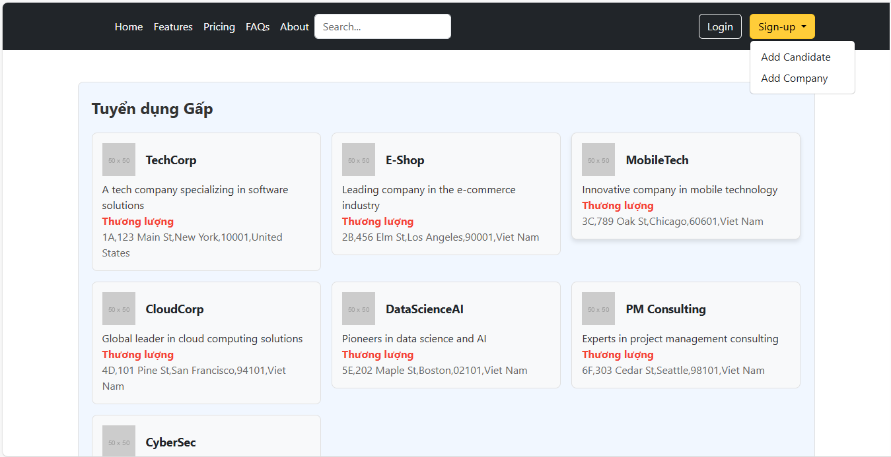
   Giao diện AddCandidate
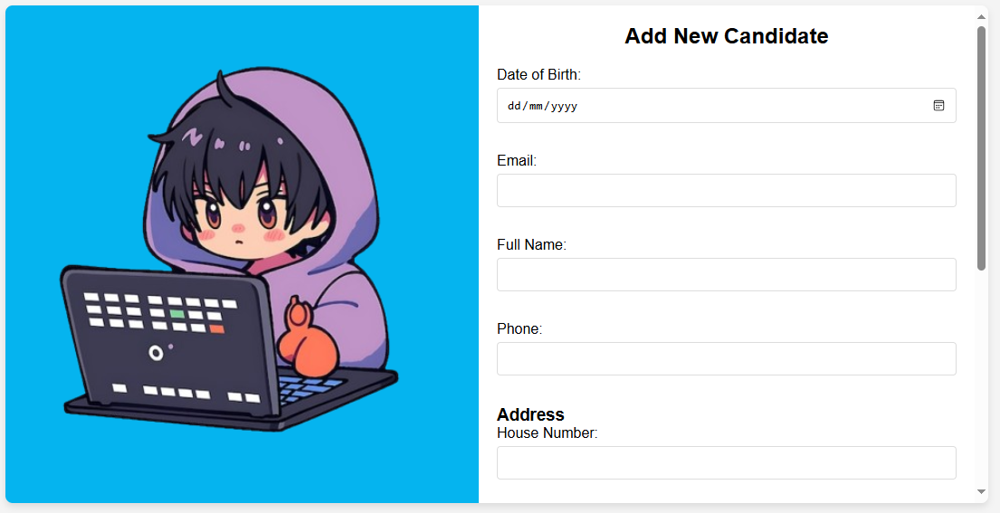
    Giao diện AddCompany
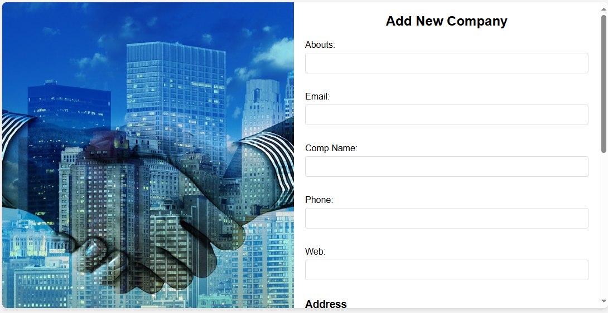
   Bấm vào login để log email tương ứng
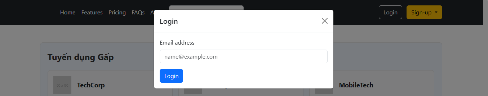
   Login thành công của Candidate sẽ hiển thị ra kĩ năng và công việc phù hợp của Candidate
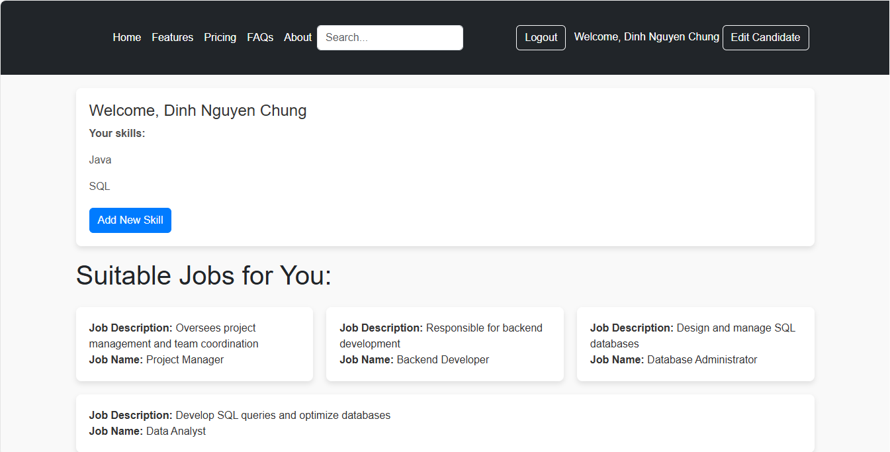
   Nếu chưa có skill nào , Candidate có thể add mới skill để hiển thị ra Jobs phù hợp
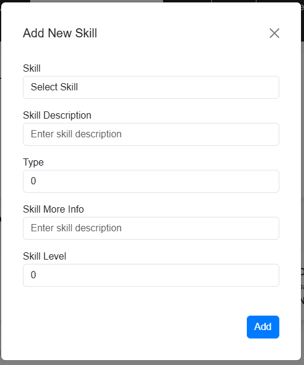
   Candidate có thể edit thông tin cá nhân của mình
   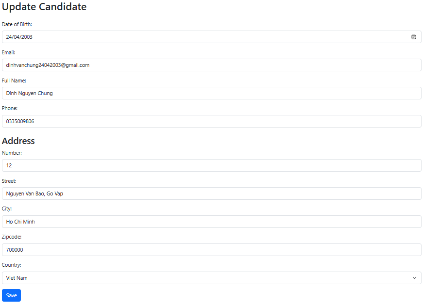

    Login thành công của company sẽ hiển thị ra những bài tuyển dụng cho công việc và kí năng yêu cầu
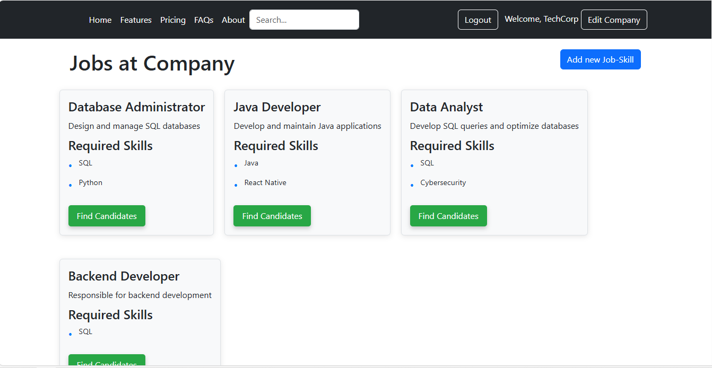
   Company có thể add bài tuyển dụng mới (Add JobSkills)
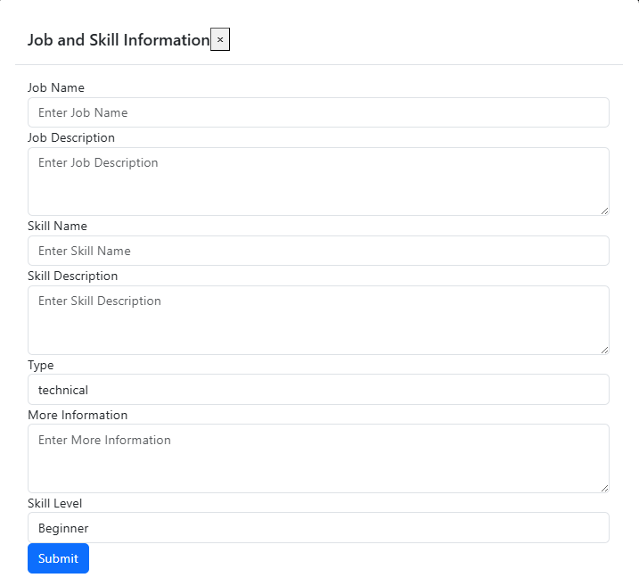
   Trên mỗi bài khi bấm vào findCandidates sẽ hiển ra danh sách những Candidate phù hợp với công việc đó
   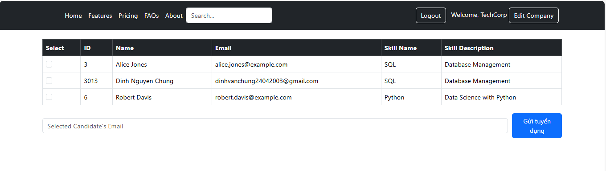
   Khi select candidate nào sẽ hiển thị ra email tương ứng và bấm gửi tuyển dụng cho Candidate đó
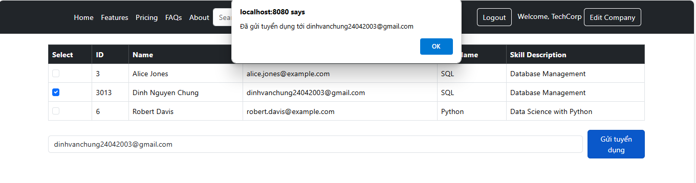
### Notes
Tabs Header đã có ràng buộc giữa home,logout,sigup,edit
 
